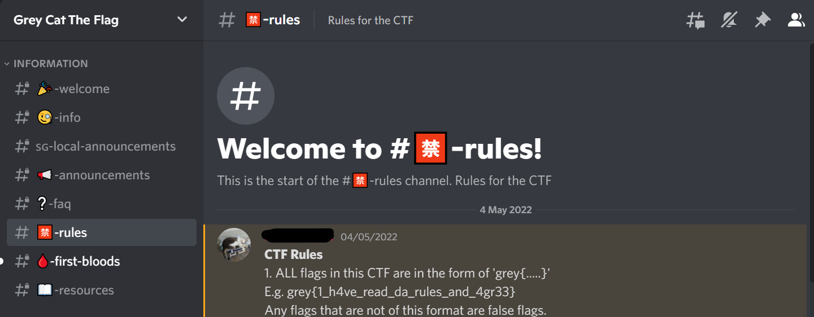
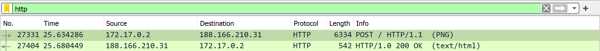
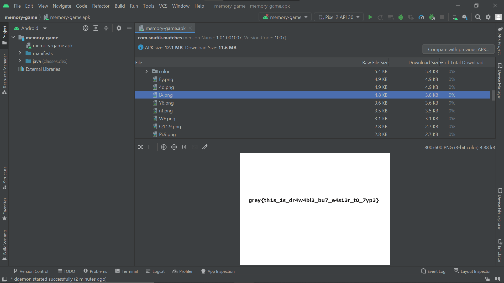

# GreyCTF

## 🍭 Welcome


### Description
Join our discord server @ [https://discord.gg/d9wbXEP2wN](https://discord.gg/d9wbXEP2wN).
The flag is in #rules.

### Summary
Simply join the server and look at the first message in the rules channel.


### Flag
```
grey{1_h4ve_read_da_rules_and_4gr33}
```

## Ghost


### Description
I tried to send you a bunch of messages :)

- [ghost](files/ghost)

### Summary
Since this ends with a `=`, we know that it is Base 64 encoded.
```
NTQgNjggNjkgNzMgMjAgNjkgNzMgMjAgNmUgNmYgNzQgMjAgNjkgNzQgMjAgNmQgNjEgNmUgMmMgMjAgNzQgNzIgNzkgMjAgNjggNjEgNzIgNjQgNjUgNzIgMjE=
```

Decoding with CyberChef reveals the following numbers which seems like ASCII, but upon closer look, it turned out to be hex. However, it is still not the flag: `This is not it man, try harder!`
```
54 68 69 73 20 69 73 20 6e 6f 74 20 69 74 20 6d 61 6e 2c 20 74 72 79 20 68 61 72 64 65 72 21
```

This turns out to be [brainf*ck](https://www.dcode.fr/brainfuck-language): `This is it? nah`
```
++++++++++[>+>+++>+++++++>++++++++++<<<<-]>>>++++++++++++++.>++++.+.++++++++++.<<++.>>----------.++++++++++.<<.>>----------.+++++++++++.<---------------------.<.>>------.-------------.+++++++.
```

Since there's `pikachu`, we simply searched for `pikachu encoding` which pointed us to a [great intepreter](https://www.dcode.fr/pikalang-language). Running the code gave us the following output: `lol no` (>:|)
```
pi pi pi pi pi pi pi pi pi pi pika pipi pi pipi pi pi pi pipi pi pi pi pi pi pi pi pipi pi pi pi pi pi pi pi pi pi pi pichu pichu pichu pichu ka chu pipi pipi pipi pipi pi pi pi pi pi pi pi pi pikachu pi pi pi pikachu ka ka ka pikachu pichu pichu pi pi pikachu pipi pipi pi pi pikachu pi pikachu
```

Although it looks like blank space (*Taylor Swift*), there is actually a mix of tabs and spaces. The hex value for space is 20 while the value for tab is 09. Hence, we can use a simple python script to convert them to binary (0 for space, 1 for tab).
```
 		  			 			  	  		  	 	 				  	 				 		 		  			 		 	     		     			  		  		 			 	 					 		   	  				  	 			 	    		  		  	  	   	 					 		 			   		     			 	   	 					  		   	 		 			  			 		  		 	  	 			  		 	  	  	 		   	  		 		    		  		 					 	
```

Next we need to convert this to text. We will probably need the ASCII values so for every 8 digits, we convert them to decimal e.g. `01100111` is `67` which is the letter `g`. We can use Python's `chr()` which converts an integer to its unicode character. This gives us the correct flag: `grey{gh0s7_byt3$_n0t_1nvisIbl3}`
```
01100111011100100110010101111001011110110110011101101000001100000111001100110111010111110110001001111001011101000011001100100100010111110110111000110000011101000101111100110001011011100111011001101001011100110100100101100010011011000011001101111101
```

And this is Base 32: `This is not the flag man D:`
```
KRUGS4ZANFZSA3TPOQQHI2DFEBTGYYLHEBWWC3RAIQ5A====
```

This seems awfully familiar, perhaps Caesar or Substitution cipher but it turned out to be Vigenere. Using another [wonderful decoder](https://www.dcode.fr/vigenere-cipher), it is still unfortunately not the flag: `flag{notThatSimple:P}`
```
synt{abgGungFvzcyr:C}
```

### Flag
```
grey{gh0s7_byt3$_n0t_1nvisIbl3}
```

## 🍭 Image Upload


### Description

HTTP is not secure. Inspect this packet dump and you will know why.

Find the packet related to an image upload and extract the image. Then, find the name of the creator of this image.

- [dump.pcap](files/dump.pcap)

### Summary
To investigate the pcap, we can use [Wireshark](https://www.wireshark.org/download.html). Browsing thru the pcap, there are some HTTP traffic which may be useful since it was mentioned in the challenge. Hence, we can filter for just the `http` traffic.



Since the challenge mentioned an image upload, we investigate the png uploaded in packet 27331. Expanding on the fields reveals the flag stored in a string right below the `Author`.


### Flag
```
grey{wireshark_exiftool_are_good}
```

## 🍭 Parcel


### Description
The binary is packed. Try to decompile it and you will find unreadable code.

Find out how it is packed and unpack it to recover the original binary.

- [parcel](files/p)

### Summary
Firstly we need to determine the type of the binary. Running `strings` on the file reveals the following lines:
```
$Info: This file is packed with the UPX executable packer http://upx.sf.net $
$Id: UPX 3.95 Copyright (C) 1996-2018 the UPX Team. All Rights Reserved. $
```

UPX is an executable packer, hence we need to unpack to get the binary inside. We can run `upx` with the `-d` option to unpack.

As we execute parcel, we can see that the program wants the address of a few functions. Hence, we can use `gdb` to inspect the binary. We then use `info functions` to retrieve the hex address of the 3 functions and convert them to decimal.
```
h12: 0x0000000000403215 = 4207125
t80: 0x0000000000406891 = 4221073
g20: 0x0000000000402e21 = 4206113
```

```
$ ./parcel 
Tell me the address of the function h12 (in decimal): 4207125
Tell me the address of the function t80 (in decimal): 4221073
Tell me the address of the function g20 (in decimal): 4206113
Congrats! grey{d1d_y0u_us3_nm_0r_objdump_0r_gdb_0r_ghidra_0r_rizin_0r_ida_0r_binja?}
```

### Flag
```
grey{d1d_y0u_us3_nm_0r_objdump_0r_gdb_0r_ghidra_0r_rizin_0r_ida_0r_binja?}
```

## 🍭 flappy-js


### Description
Are you a pro gamer? Can you get a score of 31337 in this game?

(flag format is greyctf{...} because I made a mistake :p)

http://challs.nusgreyhats.org:10529/

### Summary
Inspecting the web page reveals that there is a `clumsy-min.js` which provides the logic for the game. As the code is very long, we can use a [beautifier](https://beautifier.io/) to beautify the javascript codes in a way that is easier for us to read.

As we browse thru the codes, a certain `genFlag()` function caught our eyes. It seems the most promising.
```javascript
genFlag = function() {
    var a = "AzhkZTRlYB0GDT0NAhItAQw4LR4DEzkABjkbAwM5DywDOCFlAhIfEgY5DwMDZgQiAxETNDZkGyYPEzEbAz4lDAIDDz4HZWAmAjsfPAc5Dw0DPx87MDkxAg8RBz4YEQMsAQMDAjQSAyQEAT5o";
    a = atob(a);
    var b = "";
    for (var c in a) b += String.fromCharCode(85 ^ a.charCodeAt(c));
    return b = b.substring(0, b.indexOf("=") + 1), b = atob(b), b = atob(b), b = atob(b), b = atob(b), b = atob(b), b = atob(b)
};
```

A simple way would be to run `genFlag()` in the console and voila, it returns our flag.


### Flag
```
greyctf{5uch_4_pr0_g4m3r}
```

## 🍭 Memory Game (Part 1)


### Description
Here's a fun game to destress.

Do you know where the image assets are stored? I've made a nice drawing for you.

- [memory-game.apk](files/memory-game.apk)

### Summary
Since the file is an APK, we can simply open it using [Android Studio](https://developer.android.com/studio). Select the `Profile or Debug APK` option to start inspecting.

The image assets are stored in a folder called `res` and so we slowly look thru all the images before finding the flag in `iA.png`.



### Flag
```
grey{th1s_1s_dr4w4bl3_bu7_e4s13r_t0_7yp3}
```
